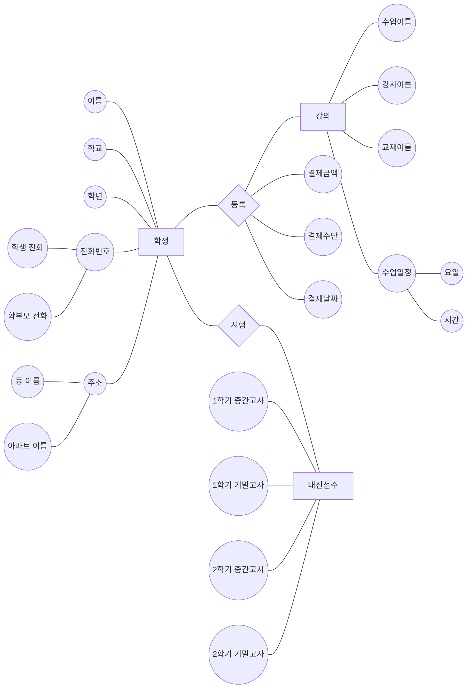
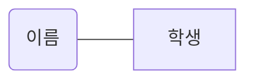

# DB_project
데이터베이스 프로젝트 주제는 학원에서 사용하는 학생 관리 프로그램입니다.  
주제를 선정하게 된 이유는 제가 학원에서 아르바이트하는 동안 원비 관리, 학생 정보 관리, 수업 관리 등 다양한 엑셀을 접해야 했습니다. 분산되어 있는 정보를 한 곳에 모으면 일의 효율이 올라갈 수 있을 것이라는 생각이 들었기 때문에 학생 관리 프로그램을 제작하기로 하였습니다.

<학생 기본 정보>  

|학생 이름|학교|학년|학생 전화번호|학부모 전화번호|주소|
|---|---|---|---|---|---|
|홍길동|용인고|2|010-9876-1234|010-3385-1234|경기도 용인시 용인구 용인동 용인아파트 101동 101호
|김대한|인용중|3|010-1133-9090|010-2323-9090|서울특별시 강남구 강남동 강남아파트 202동 202호

<강의 정보>

|수업 이름|강사 이름|교재 이름|수업 요일|
|---|---|---|---|
|고등문법|김강사|한권으로 문법 정복 1편|수|
|고등기본독해|최스승|실력향상 독해 2편|월|
|중등독해|박선생|중학생을 위해 쉽게 풀어쓴 독해 3편|금|
|고입특강|김강사|고입 대비 총정리 上|금|

<학생 수업 정보>

|학생 이름|학교|학년|듣는 수업 이름1|듣는 수업 이름2|
|---|---|---|---|---|
|홍길동|용인고|2|고등문법|고등기본독해|
|김대한|인용중|3|중등독해|고입특강|

<원비 결제 정보>

|학생 이름|학교|학년|결제 날짜|결제 금액|결제 수단|
|---|---|---|---|---|---|
|김대한|인용중|3|20210315|300,000|계좌이체|
|홍길동|용인고|2|20210311|400,000|카드|

<학생 내신 시험 점수>

|학생 이름|학교|학년|2021년 1학기 중간고사 성적|2021년 1학기 기말고사 성적|2021년 2학기 중간고사 성적|2021년 2학기 기말고사 성적|
|---|---|---|---|---|---|---|
|김대한|인용중|3|87|90|78|90|
|홍길동|용인고|2|70|80|77|95|

이런 식으로 테이블을 각각 생성할 예정이고, 수업 때 배울 내용을 활용하여 프로젝트 완성도를 높여갈 계획입니다.

● 4주차 과제) E-R 다이어그램 그리기 

● 5주차 과제) 키 생성

슈퍼키(학생 이름, 학교, 학년)를 사용하기에는 현실 세계에서 사용할 때 효율적이지 못하다고 생각되어 학생 번호 속성을 추가해서 후보키 및 기본키로 사용할 수 있게 수정하였습니다.

기본키 표시를 위해 밑줄 표시를 하려고 했는데 \<u>\</u> 문법이 적용 되지 않아 기본키 표시에 밑줄 대신 기울임체로 적용하게 되었습니다. 

<학생 기본 정보>  

|*학생 번호*|학생 이름|학교|학년|학생 전화번호|학부모 전화번호|주소|
|---|---|---|---|---|---|---|
|001|홍길동|용인고|2|010-9876-1234|010-3385-1234|경기도 용인시 용인구 용인동 용인아파트 101동 101호
|002|김대한|인용중|3|010-1133-9090|010-2323-9090|서울특별시 강남구 강남동 강남아파트 202동 202호

<강의 정보>

|*수업 이름*|강사 이름|교재 이름|수업 요일|
|---|---|---|---|
|고등문법|김강사|한권으로 문법 정복 1편|수|
|고등기본독해|최스승|실력향상 독해 2편|월|
|중등독해|박선생|중학생을 위해 쉽게 풀어쓴 독해 3편|금|
|고입특강|김강사|고입 대비 총정리 上|금|

<학생 수업 정보>

|*학생 번호*|학생 이름|듣는 수업 이름1|듣는 수업 이름2|
|---|---|---|---|
|001|홍길동|고등문법|고등기본독해|
|002|김대한|중등독해|고입특강|

<원비 결제 정보>

|*학생 번호*|학생 이름|결제 날짜|결제 금액|결제 수단|
|---|---|---|---|---|
|001|김대한|20210315|300,000|계좌이체|
|002|홍길동|20210311|400,000|카드|

<학생 내신 시험 점수>

|*학생 번호*|학생 이름|2021년 1학기 중간고사 성적|2021년 1학기 기말고사 성적|2021년 2학기 중간고사 성적|2021년 2학기 기말고사 성적|
|---|---|---|---|---|---|
|001|김대한|87|90|78|90|
|002|홍길동|70|80|77|95|

학생 기본 정보(학생 번호) : 기본키
- 학생 수업 정보(학생 번호) : 외래키
- 원비 결제 정보(학생 번호) : 외래키
- 학생 내신 시험 점수(학생 번호) : 외래키

강의 정보(수업 이름) : 기본키
- 학생 수업 정보(듣는 수업 이름1) : 외래키
- 학생 수업 정보(듣는 수업 이름2) : 외래키

● 10주차 과제) 요구사항 명세서 작성
1. 학생으로 등록하려면 학생번호, 학교, 학년, 학생전화번호, 학부모전화번호, 주소, 수업을 입력해야한다.
2. 학생은 학생번호로 식별한다.
3. 강의에 대한 수업이름, 강사이름, 교재이름, 수업시간을 유지해야한다.
4. 강의는 수업이름으로 식별한다.
5. 학생과 강의는 수강관계
6. 원비는 학년과 금액을 포함한다.
7. 학생과 원비는 납입관계
8. 납입관계 속성 - 결제날짜, 결제금액, 결제사유, 결제수단

<학생>  

|*학생번호*|학생이름|학교|학년|학생전화번호|학부모전화번호|주소|수업|
|---|---|---|---|---|---|---|---|
|001|김김김|가가중|3|010-1313-1313|010-1111-1111|서울시 마포구 마포동 아이파크|중등문법
|002|이이이|가가중|2|010-1414-1414|010-2222-2222|서울시 마포구 마포동 래미안|중등독해1
|003|박박박|나나중|3|010-3232-2323|010-3333-3333|서울시 서초구 서초동 포스코|중등독해2
|004|최최최|나나중|1|010-6565-5656|010-4444-4444|서울시 송파구 송파동 시그니엘|중등독해2
|005|정정정|다다중|2|010-9999-9999|010-5555-5555|서울시 관악구 관악동 서울아파트|중등독해3
|006|갑갑갑|라라고|3|010-4545-4545|010-3321-3455|서울시 종로구 종로동 경복궁아파트|고등문법
|007|을을을|마마고|1|010-6656-6656|010-5644-3453|서울시 노원구 노원동 노원아파트|고등문법
|008|병병병|마마고|3|010-4567-4567|010-5432-5432|서울시 광진구 광진동 광야아파트|고등독해1
|009|강강강|마마고|2|010-3352-3634|010-9879-9879|서울시 용산구 용산동 아이맥스아파트|고등독해2
|010|조조조|바바고|1|010-3465-3464|010-6767-7777|서울시 동대문구 동대문동 디디피아파트|고등독해3

<강의>

|*수업이름*|강사이름|교재이름|수업시간|
|---|---|---|---|
|중등문법|김티처|중학교 문법 끝내기|월5|
|고등문법|박티처|고등학교 문법 끝내기|화5|
|중등독해1|김강사|중학생을 위한 쉬운 독해|수5|
|중등독해2|이강사|리딩 튜터|목5|
|중등독해3|최티처|고입대비 심화 독해|금5|
|고등독해1|김티처|리딩 마스터|월7|
|고등독해2|박티처|독해 점령하기|화7|
|고등독해3|김강사|수능대비 독해책|수7|

<원비>

|학년|금액|
|---|---|
|중1|300,000|
|중2|350,000|
|중3|400,000|
|고1|450,000|
|고2|450,000|
|고3|450,000|

