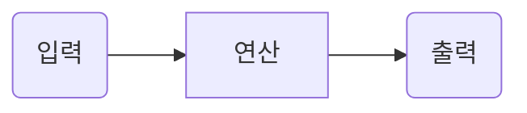

# DB_project
데이터베이스 프로젝트 주제는 학원에서 사용하는 학생 관리 프로그램입니다.  
주제를 선정하게 된 이유는 제가 학원에서 아르바이트하는 동안 원비 관리, 학생 정보 관리, 수업 관리 등 다양한 엑셀을 접해야 했습니다. 분산되어 있는 정보를 한 곳에 모으면 일의 효율이 올라갈 수 있을 것이라는 생각이 들었기 때문에 학생 관리 프로그램을 제작하기로 하였습니다.

<학생 기본 정보>  

|학생 이름|학교|학년|학생 전화번호|학부모 전화번호|주소|
|---|---|---|---|---|---|
|홍길동|용인고|2|010-9876-1234|010-3385-1234|경기도 용인시 용인구 용인동 용인아파트 101동 101호
|김대한|인용중|3|010-1133-9090|010-2323-9090|서울특별시 강남구 강남동 강남아파트 202동 202호

<강의 정보>

|수업 이름|강사 이름|교재 이름|수업 요일|
|---|---|---|---|
|고등문법|김강사|한권으로 문법 정복 1편|수|
|고등기본독해|최스승|실력향상 독해 2편|월|
|중등독해|박선생|중학생을 위해 쉽게 풀어쓴 독해 3편|금|
|고입특강|김강사|고입 대비 총정리 上|금|

<학생 수업 정보>

|학생 이름|학교|학년|듣는 수업 이름1|듣는 수업 이름2|
|---|---|---|---|---|
|홍길동|용인고|2|고등문법|고등기본독해|
|김대한|인용중|3|중등독해|고입특강|

<원비 결제 정보>

|학생 이름|학교|학년|결제 날짜|결제 금액|결제 수단|
|---|---|---|---|---|---|
|김대한|인용중|3|20210315|300,000|계좌이체|
|홍길동|용인고|2|20210311|400,000|카드|

<학생 내신 시험 점수>

|학생 이름|학교|학년|2021년 1학기 중간고사 성적|2021년 1학기 기말고사 성적|2021년 2학기 중간고사 성적|2021년 2학기 기말고사 성적|
|---|---|---|---|---|---|---|
|김대한|인용중|3|87|90|78|90|
|홍길동|용인고|2|70|80|77|95|

이런 식으로 테이블을 각각 생성할 예정이고, 수업 때 배울 내용을 활용하여 프로젝트 완성도를 높여갈 계획입니다.

https://richwind.co.kr/147
